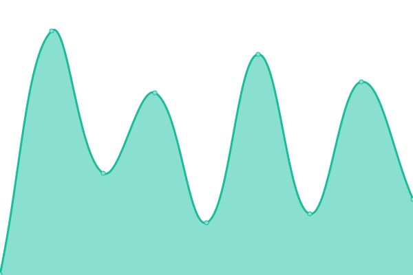

# [📈 Live Status](https://demo.upptime.js.org): <!--live status--> **🟧 Partial outage**

This repository contains the open-source uptime monitor and status page for [Santiago Prieto](https://demo.upptime.js.org), powered by [Upptime](https://github.com/upptime/upptime).

With [Upptime](https://upptime.js.org), you can get your own unlimited and free uptime monitor and status page, powered entirely by a GitHub repository. We use [Issues](https://github.com/prietosanti/upptime-test/issues) as incident reports, [Actions](https://github.com/prietosanti/upptime-test/actions) as uptime monitors, and [Pages](https://demo.upptime.js.org) for the status page.

<!--start: status pages-->
<!-- This summary is generated by Upptime (https://github.com/upptime/upptime) -->
<!-- Do not edit this manually, your changes will be overwritten -->
<!-- prettier-ignore -->
| URL | Status | History | Response Time | Uptime |
| --- | ------ | ------- | ------------- | ------ |
|  [Smartforce](https://smartforcetech.com) | 🟩 Up | [smartforce.yml](https://github.com/prietosanti/upptime-test/commits/HEAD/history/smartforce.yml) | 

 110ms
     
 | 

<a href="https://prietosanti.github.io/upptime-test/history/smartforce">100.00%</a>
    

|  [CitizenContact](https://citizencontact.app) | 🟩 Up | [citizen-contact.yml](https://github.com/prietosanti/upptime-test/commits/HEAD/history/citizen-contact.yml) | 

 115ms
     
 | 

<a href="https://prietosanti.github.io/upptime-test/history/citizen-contact">100.00%</a>
    

|  [CitizenContact QA](https://qa.citizencontact.app) | 🟩 Up | [citizen-contact-qa.yml](https://github.com/prietosanti/upptime-test/commits/HEAD/history/citizen-contact-qa.yml) | 

 209ms
     
 | 

<a href="https://prietosanti.github.io/upptime-test/history/citizen-contact-qa">100.00%</a>
    

|  [CitizenContact Demo](https://demo.citizencontact.app) | 🟩 Up | [citizen-contact-demo.yml](https://github.com/prietosanti/upptime-test/commits/HEAD/history/citizen-contact-demo.yml) | 

 140ms
     
 | 

<a href="https://prietosanti.github.io/upptime-test/history/citizen-contact-demo">100.00%</a>
    

|  [CitizenContact API](https://api.citizencontact.app) | 🟥 Down | [citizen-contact-api.yml](https://github.com/prietosanti/upptime-test/commits/HEAD/history/citizen-contact-api.yml) | 

 0ms
     
 | 

<a href="https://prietosanti.github.io/upptime-test/history/citizen-contact-api">0.06%</a>
    

<!--end: status pages-->

[**Visit our status website →**](https://demo.upptime.js.org)

## 📄 License

- Powered by: [Upptime](https://github.com/upptime/upptime)
- Code: [MIT](./LICENSE) © [Santiago Prieto](https://demo.upptime.js.org)
- Data in the `./history` directory: [Open Database License](https://opendatacommons.org/licenses/odbl/1-0/)
